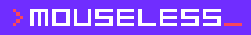
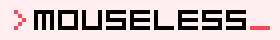
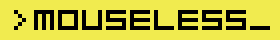

# Mouseless Brand

This repository contains all resources and usage details about Mouseless brand.
For the original brandkit you can download [brandkit.fig](./brandkit.fig) or
[brandkit.pdf](./brandkit.pdf).

## The Story

We are a software development collective centered around its experts who are
dedicated to seek perfection in their work. We work slow but sure. And we see
"what" as value for our customers and "how" as value for the collective itself.

Inspired from this vision, we named our collective as __Mouseless__.

Our intention is to make everyone in the team use their mouse less, and
preferably become a mouseless developer.

## Usage In Plain Text

Mouseless name should be used in lowercase (`mouseless`) wherever suitable
unless you use it in a formal context or a documentation, like in this
document. Social media profile names should be lowercase as well.

## Logo Construction

Logo consists of three parts, greater than symbol `>`, brand name `mouseless`
or initial `m` and an underscore `_`.

There are;

- three forms: _mark_, _full_, _short_
- three colors for mark: _primary_, _black_ and _white_
- four colors for full and short: _primary_, _secondary_, _black_ and _white_

As a result there are 11 combinations as shown below;

| color \ form  | mark     | full     | short    |
| ---           | ---      | ---      | ---      |
| __primary__   | ![lmp][] | ![lfp][] | ![lsp][] |
| __secondary__ | N/A      | ![lfs][] | ![lss][] |
| __white__     | ![lmw][] | ![lfw][] | ![lsw][] |
| __black__     | ![lmb][] | ![lfb][] | ![lsb][] |

Unlike a regular logo, we prefer dark background over a light one, because the
terminal feel comes from a dark background.

### Logo usage in plain text

When logo is needed in a place where image cannot be included, you may use
`> m_` or `> mouseless_`.

## How to Choose

Among 11 above alternatives it looks hard to choose which one to use. Let's
make it easy.

First of all, every alternative is valid and can be used. There is no
restriction. However, if you use a logo this means you want it to be noticed
and look nice. Below is a list of suggestions to achieve this;

- Prefer _primary_ & _secondary_ logos over _black_ & _white_ wherever possible
- Use _primary_ & _white_ for dark backgrounds, _secondary_ & _black_ for light
  backgrounds
  - When you use _mark_, there is only _primary_ color which might fit both
    light and dark backgrounds.
- Form preference is _full_, then _short_. If none fits well, use _mark_.

Below are some examples;

| Logo on backgrounds                  |
| ---                                  |
|    |
|  |
|      |
|      |

### Finding a logo

[assets/logo](./assets/logo) folder includes all of the existing exported
files. All of these exported files are valid and can be used where they fit.
Use `.svg` files where possible, if not, use `.png` files with a suitable size.

#### SVG files

`.svg` files are in [assets/logo/svg](./assets/logo/svg) folder. Below is the
naming convention for svg files;

```
logo-full-primary.svg

logo-[form]-[color].svg
```

#### PNG files

`.png` files are in [assets/logo/png](./assets/logo/png) folder. There are four
folders indicating different sizes named `xs`, `s`, `m` and `l` that are `5px`,
`50px`, `150px` and  `500px` in height respectively.

Below is the naming convention for png files;

```
logo-short-secondary-5px.png
logo-full-black-50px.png

logo-[form]-[color]-[height].png
```

### Exporting a new logo

If existing exported files does not suit your need, you can use
[brandkit.fig](./brandkit.fig) file to export a new one.

> ℹ️  Logo is pixel compliant, so you can use a perfect logo even if you have 5
> pixels of height. On the other hand full logo may feel long, so you may use a
> 5x5 mark form or a 17x5 short form.

## Social media

Profile pictures are exported including background so that it can fit better
with social media channels. They come with two colors, primary and secondary,
and three forms, mark, short and terminal.

| color \ form  | mark      | short     | terminal  |
| ---           | ---       | ---       | ---       |
| __primary__   | ![lpmp][] | ![lpsp][] | ![lptp][] |
| __secondary__ | ![lpms][] | ![lpss][] | ![lpts][] |

These exports are in [assets/logo/profile](./assets/logo/profile) folder with
the following naming convention;

```
logo-profile-short-primary.svg
logo-profile-terminal-secondary-500px.png

logo-profile-[form]-[color].svg
logo-profile-[form]-[color]-[height].png
```

### How to Choose

Depending on the platform, you may prefer mark form or short form. If target
platform places brand name on the right side of profile picture, then it is
better to use only mark form, e.g. Github. If profile picture is used stand
alone, then you may consider using short form. Terminal form is there just for
fun, use it if you feel it is suitable.

## Watermarks

Use watermarks to protect and copyright photos and videos online. Watermarks
are exported to [assets/logo/watermark](./assets/logo/watermark) in `15%`,
`22.5%` and `30%` opacities using only black/white colors in all forms.

Below is the naming convention for watermark logos;

```
logo-watermark-full-black-0.15.svg
logo-watermark-short-black-0.225.svg

logo-watermark-[form]-[color]-[opacity].svg
```

> ⚠️  Don't use watermarks directly in html, because they are meant to be used
> on existing photos or videos. There are also no `.png` exports available,
> because of the same reason.

## Badges

There are no apparent use cases for badges, but they are prepared anyway.
_primary_ and _secondary_ badges are more suitable for brand related badges,
whereas _black_ and _white_ badges can be used as status badges etc.

| Type        | Badge     |
| ---         | ---       |
| _primary_   | ![lbmp][] |
| _secondary_ | ![lbms][] |
| _white_     | ![lbmw][] |
| _black_     | ![lbmb][] |

## Colors

Primary brand color is 
`#F9465B` and we use black
 `#000000` and white
 `#FFFFFF` to create
contrast.

### Inspiration

Mouseless is founded by [Cihan Deniz](https://github.com/cihandeniz) to create
a collective where developers can join and perform their craft with passion.
Without being certain of what this collective may become in the future,
Mouseless brand uses the same color as [GC
Brains](https://github.com/gcbrains/brand#colors) to leave a mark in the brand
hoping to remind its roots and core values to a future mouseless developer.

[lmp]: ./assets/logo/png/s/logo-mark-primary-50px.png
[lmw]: ./assets/logo/png/s/logo-mark-white-50px.png
[lmb]: ./assets/logo/png/s/logo-mark-black-50px.png
[lfp]: ./assets/logo/png/s/logo-full-primary-50px.png
[lfs]: ./assets/logo/png/s/logo-full-secondary-50px.png
[lfw]: ./assets/logo/png/s/logo-full-white-50px.png
[lfb]: ./assets/logo/png/s/logo-full-black-50px.png
[lsp]: ./assets/logo/png/s/logo-short-primary-50px.png
[lss]: ./assets/logo/png/s/logo-short-secondary-50px.png
[lsw]: ./assets/logo/png/s/logo-short-white-50px.png
[lsb]: ./assets/logo/png/s/logo-short-black-50px.png
[lpmp]: ./assets/logo/profile/logo-profile-mark-primary-100px.png
[lpms]: ./assets/logo/profile/logo-profile-mark-secondary-100px.png
[lpsp]: ./assets/logo/profile/logo-profile-short-primary-125px.png
[lpss]: ./assets/logo/profile/logo-profile-short-secondary-125px.png
[lptp]: ./assets/logo/profile/logo-profile-terminal-primary-125px.png
[lpts]: ./assets/logo/profile/logo-profile-terminal-secondary-125px.png

[lbmp]: https://img.shields.io/badge/dynamic/style-mouseless-000000?style=for-the-badge&label=&logo=data:image/svg+xml;base64,PHN2ZyB3aWR0aD0iNTAiIGhlaWdodD0iNTAiIHZpZXdCb3g9IjAgMCA1MCA1MCIgZmlsbD0ibm9uZSIgeG1sbnM9Imh0dHA6Ly93d3cudzMub3JnLzIwMDAvc3ZnIj4KPG1hc2sgaWQ9Im1hc2swXzEwMV8xNTE4IiBzdHlsZT0ibWFzay10eXBlOmFscGhhIiBtYXNrVW5pdHM9InVzZXJTcGFjZU9uVXNlIiB4PSIwIiB5PSIwIiB3aWR0aD0iNTAiIGhlaWdodD0iNTAiPgo8cGF0aCBkPSJNMTAgMEgyMFYxMEgxMFYwWiIgZmlsbD0id2hpdGUiLz4KPHBhdGggZD0iTTIwIDEwSDMwVjIwSDIwVjEwWiIgZmlsbD0id2hpdGUiLz4KPHBhdGggZD0iTTMwIDIwSDQwVjMwSDMwVjIwWiIgZmlsbD0id2hpdGUiLz4KPHBhdGggZD0iTTIwIDMwSDMwVjQwSDIwVjMwWiIgZmlsbD0id2hpdGUiLz4KPHBhdGggZD0iTTEwIDQwSDIwVjUwSDEwVjQwWiIgZmlsbD0id2hpdGUiLz4KPC9tYXNrPgo8ZyBtYXNrPSJ1cmwoI21hc2swXzEwMV8xNTE4KSI+CjxyZWN0IHdpZHRoPSI1MCIgaGVpZ2h0PSI1MCIgZmlsbD0iI0Y5NDY1QiIvPgo8L2c+Cjwvc3ZnPgo=
[lbms]: https://img.shields.io/badge/dynamic/style-mouseless-ffffff?style=for-the-badge&label=&logo=data:image/svg+xml;base64,PHN2ZyB3aWR0aD0iNTAiIGhlaWdodD0iNTAiIHZpZXdCb3g9IjAgMCA1MCA1MCIgZmlsbD0ibm9uZSIgeG1sbnM9Imh0dHA6Ly93d3cudzMub3JnLzIwMDAvc3ZnIj4KPG1hc2sgaWQ9Im1hc2swXzEwMV8xNTE4IiBzdHlsZT0ibWFzay10eXBlOmFscGhhIiBtYXNrVW5pdHM9InVzZXJTcGFjZU9uVXNlIiB4PSIwIiB5PSIwIiB3aWR0aD0iNTAiIGhlaWdodD0iNTAiPgo8cGF0aCBkPSJNMTAgMEgyMFYxMEgxMFYwWiIgZmlsbD0id2hpdGUiLz4KPHBhdGggZD0iTTIwIDEwSDMwVjIwSDIwVjEwWiIgZmlsbD0id2hpdGUiLz4KPHBhdGggZD0iTTMwIDIwSDQwVjMwSDMwVjIwWiIgZmlsbD0id2hpdGUiLz4KPHBhdGggZD0iTTIwIDMwSDMwVjQwSDIwVjMwWiIgZmlsbD0id2hpdGUiLz4KPHBhdGggZD0iTTEwIDQwSDIwVjUwSDEwVjQwWiIgZmlsbD0id2hpdGUiLz4KPC9tYXNrPgo8ZyBtYXNrPSJ1cmwoI21hc2swXzEwMV8xNTE4KSI+CjxyZWN0IHdpZHRoPSI1MCIgaGVpZ2h0PSI1MCIgZmlsbD0iI0Y5NDY1QiIvPgo8L2c+Cjwvc3ZnPgo=
[lbmw]: https://img.shields.io/badge/dynamic/style-mouseless-000000?style=for-the-badge&label=&logo=data:image/svg+xml;base64,PHN2ZyB3aWR0aD0iNTAiIGhlaWdodD0iNTAiIHZpZXdCb3g9IjAgMCA1MCA1MCIgZmlsbD0ibm9uZSIgeG1sbnM9Imh0dHA6Ly93d3cudzMub3JnLzIwMDAvc3ZnIj4KPG1hc2sgaWQ9Im1hc2swXzEwMV8xNTQxIiBzdHlsZT0ibWFzay10eXBlOmFscGhhIiBtYXNrVW5pdHM9InVzZXJTcGFjZU9uVXNlIiB4PSIwIiB5PSIwIiB3aWR0aD0iNTAiIGhlaWdodD0iNTAiPgo8cGF0aCBkPSJNMTAgMEgyMFYxMEgxMFYwWiIgZmlsbD0iYmxhY2siLz4KPHBhdGggZD0iTTIwIDEwSDMwVjIwSDIwVjEwWiIgZmlsbD0iYmxhY2siLz4KPHBhdGggZD0iTTMwIDIwSDQwVjMwSDMwVjIwWiIgZmlsbD0iYmxhY2siLz4KPHBhdGggZD0iTTIwIDMwSDMwVjQwSDIwVjMwWiIgZmlsbD0iYmxhY2siLz4KPHBhdGggZD0iTTEwIDQwSDIwVjUwSDEwVjQwWiIgZmlsbD0iYmxhY2siLz4KPC9tYXNrPgo8ZyBtYXNrPSJ1cmwoI21hc2swXzEwMV8xNTQxKSI+CjxyZWN0IHdpZHRoPSI1MCIgaGVpZ2h0PSI1MCIgZmlsbD0id2hpdGUiLz4KPC9nPgo8L3N2Zz4K
[lbmb]: https://img.shields.io/badge/dynamic/style-mouseless-ffffff?style=for-the-badge&label=&logo=data:image/svg+xml;base64,PHN2ZyB3aWR0aD0iNTAiIGhlaWdodD0iNTAiIHZpZXdCb3g9IjAgMCA1MCA1MCIgZmlsbD0ibm9uZSIgeG1sbnM9Imh0dHA6Ly93d3cudzMub3JnLzIwMDAvc3ZnIj4KPG1hc2sgaWQ9Im1hc2swXzEwMV8xNTM0IiBzdHlsZT0ibWFzay10eXBlOmFscGhhIiBtYXNrVW5pdHM9InVzZXJTcGFjZU9uVXNlIiB4PSIwIiB5PSIwIiB3aWR0aD0iNTAiIGhlaWdodD0iNTAiPgo8cGF0aCBkPSJNMTAgMEgyMFYxMEgxMFYwWiIgZmlsbD0id2hpdGUiLz4KPHBhdGggZD0iTTIwIDEwSDMwVjIwSDIwVjEwWiIgZmlsbD0id2hpdGUiLz4KPHBhdGggZD0iTTMwIDIwSDQwVjMwSDMwVjIwWiIgZmlsbD0id2hpdGUiLz4KPHBhdGggZD0iTTIwIDMwSDMwVjQwSDIwVjMwWiIgZmlsbD0id2hpdGUiLz4KPHBhdGggZD0iTTEwIDQwSDIwVjUwSDEwVjQwWiIgZmlsbD0id2hpdGUiLz4KPC9tYXNrPgo8ZyBtYXNrPSJ1cmwoI21hc2swXzEwMV8xNTM0KSI+CjxyZWN0IHdpZHRoPSI1MCIgaGVpZ2h0PSI1MCIgZmlsbD0iYmxhY2siLz4KPC9nPgo8L3N2Zz4K
